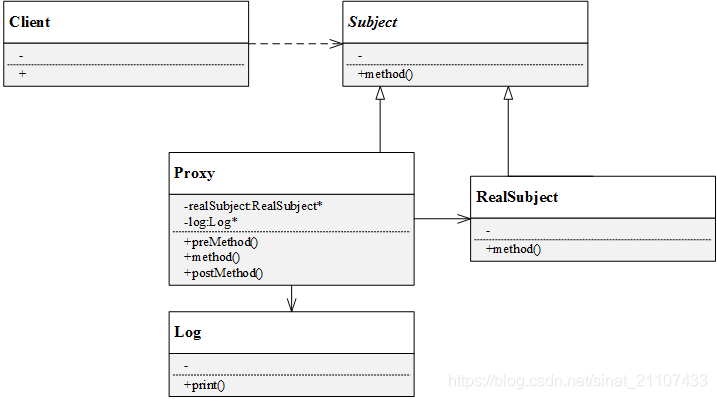
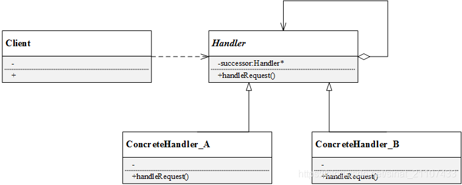
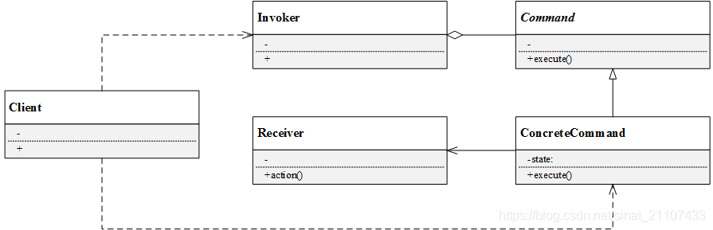

<!--
 * @Author: YichaoZhao
 * @Date: 2021-03-24 10:03:35
 * @LastEditTime: 2021-03-25 18:33:17
 * @LastEditors: YichaoZhao
 * @Description: 
 * @FilePath: /Mlog/CodingLog/doc/DesignPatterns.md
-->

# 设计模式

设计模式是为了解决某类重复出现的问题而出现的一套成功或有效的解决方案。

设计模式一般包括模式名称(Pattern Name), 问题(Problem), 解决方案(Solution), 效果(Consequence).

## 设计模式的作用和分类

狭义的设计模式一般分为3大类23种,其中,创建型模式关注对象的创建过程,结构型模式关注如何将现有类或对象组织在一起形成更强大的结构,行为型模式关注系统中对象之间的交互研究系统在运行时对象之间的相互通信协作,进一步明确对象的职责.

设计模式分类

|类型|种类|
|-|-|
|创建型模式|单例模式, 简单工厂模式, 抽象工厂模式, 工厂方法模式, 原型模式, 建造者模式|
|结构型模式|适配器模式, 桥接模式, 组合模式, 装饰模式, 外观模式, 享元模式, 代理模式|
|行为模式|职责链模式, 命令模式, 解释器模式, 迭代模式, 中介者模式, 备忘录模式, 观察者模式, 状态模式, 策略模式, 模板方法模式, 访问者模式|

## UML类图(Unified Model Language)

类图中的常见关系: 泛化(Generalization), 实现(Realization), 关联(Association), 聚合(Aggregation), 组合(Composition), 依赖(Dependency)

泛化: 空心三角和实线 类的继承 子类指向父类
实现: 空心三角和虚线 类和接口的关系 空心三角指向接口
关联: 关联是一种关系(has), 一个类可以调用另一个类的共有的属性和方法,在类中以成员变量的方式表示.比如老师有自己的学生,知道学生的姓名学号成绩,学生有自己老师,也知道老师的姓名和所教科目.关联分为单向关联(用带箭头的直线表示),双向关联(直线),自关联. 
聚合: 整体和部分的关系,部分离开整体后可以单独存在.菱形箭头表示. 菱形挨着整体
组合: 整体和部分的关系,部分离开整体不可以单独存在,实心菱形
依赖: 是一种使用关系,即一个类的实现需要另一个类的协助.常用于方法的局部变量,方法参数等. 带箭头的虚线,虚线指向协助类.

## 面向对象设计原则

设计模式需要遵循基本的软件设计原则. **可维护性(Maintainable)** 和 **可复用性(Reusable)** 是衡量软件质量的两个重要属性.

1. 单一职责原则
定义1: 一个对象应该只包含单一的职责,并且改职责被完整地封装在一个类中.
定义2: 就一个类而言,应该仅有一个引起它变化的原因.

首先需要知道两个原则:**高聚合**和**低耦合**
高聚合: 内聚是对软件系统中元素职责相关性和集中度的度量.如果元素具有高度相关的职责,除了这些职责内的任务,没有其他过多的工作,那么改元素就具有高内聚性.
低耦合: 耦合是软件结构中各类模块之间相互连接的一种度量, 耦合强弱取决于模块间接接口的复杂程度

2. 开闭原则
软件实体应该对扩展开放,对修改关闭.
开闭原则指软件实体应该在不修改原有代码的基础上进行扩展.软件设计过程中,需求可能会随时变化,需要根据需求扩展已有的设计.如果原有的设计符合开闭原则,那么扩展起来就比较安全(不会影响原有的功能,稳定)和方便(易于扩展).开闭原则的关键在于抽象化.可以为系统定义一个相对较为稳定的抽象层,将不同的实现行为放到具体的实现层中完成.
举个例子:要设计一个计算器的类,包含加减两个功能,很自然的想法是在类computer里声明并实现add和sub两个方法,那么如果要求再增加乘法功能,是不是哟啊在computer里增加mul的方法呢?这样就违背了开闭原则

3. 里氏代换原则
所有引用基类的地方必须能透明地使用其子类的对象.
在软件中, 如果用子类对象来替换基类对象,程序将不会产生任何异常和问题,反过来不成立

里氏代换原则的指导意义在与:尽可能地使用基类类型来替换基类对象,程序将不会产生任何异常和问题,而在运行时再确定子类类型,然后用子类对象替换父类对象.设计时应将父类设计为抽象类或接口,子类继承父类并实现在父类中声明的方法;运行时子类实例(对象)替换父类实例(对象),可以很方便地扩展系统功能.

4. 依赖倒转原则.
依赖倒转原则: 高层模块不应该依赖底层模块,它们都应该依赖抽象.抽象不应该依赖细节,细节应该依赖于抽象.
什么是高层,什么是低层呢? 它们指的是继承中的基类子类关系,基类或者越抽象的类,层次越高,简单说,倒转依赖原则要求针对接口编程,不要针对实现编程.

依赖倒转原则要求在程序代码中传递参数, 或在关联关系中, 尽量引用层次高的出现层类,即使用接口或抽象类来声明变量, 参数类型声明, 方法返回类型声明, 以及数据类型转换等.而不要用具体的类来做这些事情.

5. 接口隔离原则
客户端不应该依赖那些它不需要的接口

6. 合成复用原则
优先使用对象组合, 而不是用过继承来达到复用的目的.
合成复用原则指导在软件设计时,优先使用关联, 聚合和组合的关系,尽量少使用泛化(继承)

7. 迪米特法则
每一个软件单位对其他单位都只有最少的知识, 而且局限于那些与本单位密切相关的软件单位

### 1.简单工厂模式

代码: 

    //抽象产品类AbstractProduct
    class AbstractProduct
    {
    public:
        //抽象方法：
    };
    
    //具体产品类Basketball
    class ConcreteProduct :public AbstractProduct
    {
    public:
        //具体实现方法
    };
    
    class Factory
    {
    public:
        shared_ptr<AbstractProduct> createProduct(string productName)
        {
            if (productName == "ProductA"){
                return make_shared<ProductA>();
            }
            else if (productName == "ProductB"){
                return make_shared<ProductB>();
            }
            ...
        }
    };

简单工厂模式存在者明显的不足,违反了开闭原则

### 2.工厂模式
简单工厂模式中，每新增一个具体产品，就需要修改工厂类内部的判断逻辑。为了不修改工厂类，遵循开闭原则，工厂方法模式中不再使用工厂类统一创建所有的具体产品，而是针对不同的产品设计了不同的工厂，每一个工厂只生产特定的产品。

工厂方法模式：定义一个用于创建对象的接口，但是让子类决定将哪一个类实例化。工厂方法模式让一个类的实例化延迟到其子类。

抽象工厂（AbstractFactory）：所有生产具体产品的工厂类的基类，提供工厂类的公共方法；
具体工厂（ConcreteFactory）：生产具体的产品
抽象产品（AbstractProduct）：所有产品的基类，提供产品类的公共方法
具体产品（ConcreteProduct）：具体的产品类

代码:

定义抽象产品类AbstractSportProduct，方法不提供实现

    //抽象产品类AbstractProduct
    class AbstractSportProduct
    {
    public:
        AbstractSportProduct(){
    
        }
        //抽象方法：
        void printName(){};
        void play(){};
    };

定义三个具体产品类

    //具体产品类Basketball
    class Basketball :public AbstractSportProduct
    {
    public:
        Basketball(){
            printName();
            play();
        }
        //具体实现方法
        void printName(){
            printf("Jungle get Basketball\n");
        }
        void play(){
            printf("Jungle play Basketball\n\n");
        }
    };
    
    //具体产品类Football
    class Football :public AbstractSportProduct
    {
    public:
        Football(){
            printName();
            play();
        }
        //具体实现方法
        void printName(){
            printf("Jungle get Football\n");
        }
        void play(){
            printf("Jungle play Football\n\n");
        }
    };
    
    //具体产品类Volleyball
    class Volleyball :public AbstractSportProduct
    {
    public:
        Volleyball(){
            printName();
            play();
        }
        //具体实现方法
        void printName(){
            printf("Jungle get Volleyball\n");
        }
        void play(){
            printf("Jungle play Volleyball\n\n");
        }
    };

定义抽象工厂类AbstractFactory，方法为纯虚方法

    //抽象工厂类
    class AbstractFactory
    {
    public:
        virtual shared_ptr<AbstractSportProduct> getSportProduct() = 0;
    };

定义三个具体工厂类

    /具体工厂类BasketballFactory
    class BasketballFactory :public AbstractFactory
    {
    public:
        BasketballFactory(){
            printf("BasketballFactory\n");
        }
        shared_ptr<AbstractSportProduct> getSportProduct(){
            printf("basketball");
            return make_shared<Basketball>();
        }
    };
    
    //具体工厂类FootballFactory
    class FootballFactory :public AbstractFactory
    {
    public:
        FootballFactory(){
            printf("FootballFactory\n");
        }
        shared_ptr<AbstractSportProduct> getSportProduct(){
            return make_shared<Football>();
        }
    };
    
    //具体工厂类VolleyballFactory
    class VolleyballFactory :public AbstractFactory
    {
    public:
        VolleyballFactory(){
            printf("VolleyballFactory\n");
        }
        shared_ptr<AbstractSportProduct> getSportProduct(){
            return  make_shared<Volleyball>();
        }
    };

客户端使用方法

    #include <iostream>
    #include "FactoryMethod.h"
    
    int main()
    {
        printf("工厂方法模式\n");
        
        //定义工厂类对象和产品类对象
        shared_ptr<AbstractFactory> fac;
        shared_ptr<AbstractSportProduct> product;
    
        fac = make_shared<BasketballFactory>();
        product = fac->getSportProduct();
    
        fac = make_shared<FootballFactory>();
        product = fac->getSportProduct();
    
        fac = make_shared<VolleyballFactory>();
        product = fac->getSportProduct();	
    
        system("pause");
        return 0;
    }

工厂模式总结

优点:

* 工厂方法用于创建客户所需产品，同时向客户隐藏某个具体产品类将被实例化的细节，用户只需关心所需产品对应的工厂；
* 工厂自主决定创建何种产品，并且创建过程封装在具体工厂对象内部，多态性设计是工厂方法模式的关键；
* 新加入产品时，无需修改原有代码，增强了系统的可扩展性，符合开闭原则。

缺点:

* 添加新产品时需要同时添加新的产品工厂，系统中类的数量成对增加，增加了系统的复杂度，更多的类需要编译和运行，增加了系统的额外开销；
* 工厂和产品都引入了抽象层，客户端代码中均使用的抽象层（AbstractFactory和AbstractSportProduct ），增加了系统的抽象层次和理解难度。

### 3.抽象工厂模式

提供一个创建一系列相关或相互依赖对象的接口,而无需指定它们具体的类.
简而言之,一个工厂可以提供创建多种相关产品的接口, 而无需像工厂方法一样,为每一个产品都提供一个具体工厂.

* 抽象工厂（AbstractFactory）：所有生产具体产品的工厂类的基类，提供工厂类的公共方法；
* 具体工厂（ConcreteFactory）：生产具体的产品
* 抽象产品（AbstractProduct）：所有产品的基类，提供产品类的公共方法
* 具体产品（ConcreteProduct）：具体的产品类

案例:
Jungle想要进行户外运动，它可以选择打篮球和踢足球。但这次Jungle不想弄脏原本穿的T恤，所以Jungle还需要穿球衣，打篮球就穿篮球衣，踢足球就穿足球衣。篮球保管室可以提供篮球和篮球衣，足球保管室可以提供足球和足球衣。Jungle只要根据心情去某个保管室，就可以换上球衣、拿上球，然后就可以愉快地玩耍了。

#### 1. 产品类:

##### 1.1 产品类ball

抽象产品类AbstractBall, 球类的基类，定义抽象方法play

    //抽象产品类AbstractBall
    class AbstractBall
    {
    public:
    	AbstractBall(){}
    	//抽象方法：
    	void play(){};
    };

具体产品类， 分别为Basketball和Football，具体实现方法play

    //具体产品类Basketball
    class Basketball :public AbstractBall
    {
    public:
        Basketball(){
            play();
        }
        //具体实现方法
        void play(){
            printf("Jungle play Basketball\n\n");
        }
    };
    
    //具体产品类Football
    class Football :public AbstractBall
    {
    public:
        Football(){
            play();
        }
        //具体实现方法
        void play(){
            printf("Jungle play Football\n\n");
        }
    };

##### 1.2 产品类shirt

抽象产品类AbstractShirt：球衣类的基类，定义抽象方法wearShirt

    //抽象产品类AbstractShirt
    class AbstractShirt
    {
    public:
        AbstractShirt(){}
        //抽象方法：
        void wearShirt(){};
    };

具体产品类BasketballShirt和FootballShirt，具体实现方法wearShirt

    //具体产品类BasketballShirt
    class BasketballShirt :public AbstractShirt
    {
    public:
        BasketballShirt(){
            wearShirt();
        }
        //具体实现方法
        void wearShirt(){
            printf("Jungle wear Basketball Shirt\n\n");
        }
    };
    
    //具体产品类FootballShirt
    class FootballShirt :public AbstractShirt
    {
    public:
        FootballShirt(){
            wearShirt();
        }
        //具体实现方法
        void wearShirt(){
            printf("Jungle wear Football Shirt\n\n");
        }
    };

#### 2. 定义工厂类

定义抽象工厂AbstractFactory，声明两个方法getBall和getShirt

    //抽象工厂类
    class AbstractFactory
    {
    public:
        virtual AbstractBall *getBall() = 0;
        virtual AbstractShirt *getShirt() = 0;
    };

定义具体工厂BasketballFactory和FootballFactory，重新具体实现两个方法getBall和getShirt

    //具体工厂类BasketballFactory
    class BasketballFactory :public AbstractFactory
    {
    public:
        BasketballFactory(){
            printf("BasketballFactory\n");
        }
        AbstractBall *getBall(){
            printf("Jungle get basketball\n");
            return new Basketball();
        }
        AbstractShirt *getShirt(){
            printf("Jungle get basketball shirt\n");
            return new BasketballShirt();
        }
    };
    
    //具体工厂类BasketballFactory
    class FootballFactory :public AbstractFactory
    {
    public:
        FootballFactory(){
            printf("FootballFactory\n");
        }
        AbstractBall *getBall(){
            printf("Jungle get football\n");
            return new Football();
        }
        AbstractShirt *getShirt(){
            printf("Jungle get football shirt\n");
            return new FootballShirt();
        }
    };

#### 3. 客户端

    #include <iostream>
    #include "AbstractFactory.h"
    
    int main()
    {
        printf("抽象工厂模式\n");
        
        //定义工厂类对象和产品类对象
        AbstractFactory *fac = NULL;
        AbstractBall *ball = NULL;
        AbstractShirt *shirt = NULL;
    
        fac = new BasketballFactory();
        ball = fac->getBall();
        shirt = fac->getShirt();
    
        fac = new FootballFactory();
        ball = fac->getBall();
        shirt = fac->getShirt();
    
        system("pause");
        return 0;
    }

## 4. 建造者模式

将一个复杂对象构建与它的表示分离, 使得同样的构建过程可以创建不同的表示.

同样的构建过程可以创建不同的表示?? 想象一下, 建造一栋房子, 建造过程无非都是打地基,筑墙,安装门窗等过程,但不同的客户可能希望不同的风格或过程,最终呈现出来的房子就是不同的风格了.

* 抽象建造者（AbstractBuilder）：创建一个Product对象的各个部件指定的抽象接口；
* 具体建造者（ConcreteBuilder）：实现AbstractBuilder的接口，实现各个部件的具体构造方法和装配方法，并返回创建结果。
* 产品（Product）：具体的产品对象
* 指挥者（Director）： 构建一个使用Builder接口的对象，安排复杂对象的构建过程，客户端一般只需要与Director交互，指定建造者类型，然后通过构造函数或者setter方法将具体建造者对象传入Director。它主要作用是：隔离客户与对象的生产过程，并负责控制产品对象的生产过程。

## 5. 原型模式

使用原型实例指定待创建对象的类型,并且通过复制这个原型来创建新的对象.

原型模式的工作原理是将一个原型对象传给要发动创建的对象(即客户端对象), 这个要发动创建的对象通过请求原型对象复制自己来实现创建过程. 从工厂方法角度而言, 创建新对象的工厂就是原型类自己.软件系统中有些对象的创建过程比较复杂, 且有时需要频繁创建, 原型模式通过给出一个原型对象来指明所要创建的对象类型,然后用复制这个原型兑现改的办法创建出更多同类型的对象,这就是原型模式的意图所在.

原型模式结构:

* 抽象原型类（AbstractPrototype）：声明克隆clone自身的接口
* 具体原型类（ConcretePrototype）：实现clone接口
* 客户端（Client）：客户端中声明一个抽象原型类，根据客户需求clone具体原型类对象实例

## 6. 单例模式

单例模式:
确保只有一个类只有一个实例, 并且提供一个全局访问点来访问这个唯一实例.

单例模式需要注意多线程的时候需要加锁

## 7. 适配器模式

当组合需要使用的类型不兼容时, 也需要类似于变压器一样的适配器来协调这些不兼容者, 这就是适配器模式.

## 8. 桥接模式

将抽象的部分与它的实现部分解耦,使得两者都能够独立变化.

* Abstraction（抽象类）：定义抽象类的接口（抽象接口），由聚合关系可知，抽象类中包含一个Implementor类型的对象，它与Implementor之间有关联关系，既可以包含抽象业务方法，也可以包含具体业务方法；
* Implementor（实现类接口）：定义实现类的接口，这个接口可以与Abstraction类的接口不同。一般而言，实现类接口只定义基本操作，而抽象类的接口还可能会做更多复杂的操作。
* RefinedAbstraction（扩充抽象类）：具体类，实现在抽象类中定义的接口，可以调用在Implementor中定义的方法；
* ConcreteImplementor（具体实现类）：具体实现了Implementor接口，在不同的具体实现类中实现不同的具体操作。运行时ConcreteImplementor将替换父类。

桥接模式总结:

优点： 

* 分离抽象接口与实现部分，使用对象间的关联关系使抽象与实现解耦；
* 桥接模式可以取代多层继承关系，多层继承违背单一职责原则，不利于代码复用；
* 桥接模式提高了系统可扩展性，某个维度需要扩展只需增加实现类接口或者具体实现类，而且不影响另一个维度，符合开闭原则。

缺点:

* 桥接模式难以理解，因为关联关系建立在抽象层，需要一开始就设计抽象层；
* 如何准确识别系统中的两个维度是应用桥接模式的难点。

## 9. 组合模式

组合多个对象形成树形结构以表示具有部分-整体关系的层次结构。组合模式让客户端可以统一对待单个对象和组合对象。

略

## 10. 装饰模式

动态地给一个对象增加一些额外的职责.就扩展而言, 装饰器模式提供了一种比使用子类更加灵活的替代方案.
装饰模式是一种用于代替集成技术的技术

优点:
对于扩展一个类的新功能，装饰模式比继承更加灵活；
动态扩展一个对象的功能；
可以对一个对象进行多次装饰（如上述例子第二个手机和第三个手机）；
具体构件类和具体装饰类可以独立变化和扩展，符合开闭原则。

缺点:
装饰模式中会增加很多小的对象，对象的区别主要在于各种装饰的连接方式不同，而并不是职责不同，大量小对象的产生会占用较多的系统资源；
装饰模式比继承模式更灵活，但也更容易出错，更难于排错。

## 11. 外观模式

为子系统中的一组接口提供一个统一的入口。外观模式定义了一个高层接口，这个接口使得这一子系统更加容易使用。

## 12. 享元模式
运用共享技术有效地支持大量细粒度对象的复用。

享元模式要求被共享的对象必须是细粒度对象。如上面提到英文段落的例子，26个字母可能随时被见客户重复使用。尽管每个字母可能出现的位置不一样，但是在物理上它们共享同一个对象。利用享元模式，可以创建一个存储26个字母对象的享元池，需要时从享元池中取出。

享元对象能够做到共享的关键在于区分了内部状态和外部状态：
内部状态： 存储在享元对象内部，不会随着环境的改变而改变，内部状态可以共享。
外部状态：如棋子的颜色，位置等

* Flyweight（抽象享元类）：是一个抽象类，声明了具体享元类公共的方法，这些方法可以向外部提供享元对象的内部状态数据，也可以通过这些方法设置外部状态；
* ConcreteFlyweight（具体享元类）：具体实现抽象享元类声明的方法，具体享元类中为内部状态提供存储空间。具体享元类常常结合单例模式来设计实现，保证每个享元类对象只被创建一次，为每个具体享元类提供唯一的享元对象。
* UnsharedConcreteFlyweight（非共享具体享元类）：并不是所有抽象享元类的子类都需要被共享，可以将这些类设计为非共享具体享元类；
* FlyweightFactory（享元工厂类）：用于创建并管理享元对象，针对抽象享元类编程，将各种具体享元类对象存储在一个享元池中，享元池一般设计为一个存储键值对的集合（或者其他类型的集合），可结合工厂模式设计。客户需要某个享元对象时，如果享元池中已有该对象实例，则返回该实例，否则创建一个新的实例，给客户返回新的实例，并将新实例保存在享元池中。

## 13. 代理模式

给某一个对象提供一个代理或占位符，并由代理对象来控制对原对象的访问。

## 14. 职责链模式

职责链模式又叫责任链模式。很多情况下，可以处理某个请求的对象可能不止一个，请求可以沿着某一条对象之间形成的关系一级一级由下家传递到上家，形成一条链——职责链。职责链可以是直线，也可以是环或树形结构。常见的职责链形式是直线。链上的每一个对象都是请求的处理者，客户端要做的仅仅是发送请求，不需要关心请求的处理细节过程。由此，职责链模式将请求者和请求的接收者解耦。

避免将一个请求的发送者和接收者耦合在一起，让多个对象都有机会处理请求。将接收请求的对象连接成一条链，并且沿着这条链传递请求，直到有一个对象能够处理它为止。

Handler（抽象处理者）：抽象处理者一般为抽象类，声明了一个处理请求的接口handleRequest()，定义了一个抽象处理者类型的对象，作为其对下家的引用，通过该引用可以形成一条责任链。
ConcreteHandler（具体处理者）： 是抽象处理者的子类，实现了处理请求的接口。在具体的实现中，如果该具体处理者能够处理该请求，就处理它，否则将该请求转发给后继者。具体处理者可以访问下一个对象。

总结： 

优点：
将请求的接收者和处理者解耦，客户端无需知道具体处理者，只针对抽象处理者编程，简化了客户端编程过程，降低系统耦合度；
在系统中增加一个新的处理者时，只需要继承抽象处理者，重新实现handleRequest()接口，无需改动原有代码，符合开闭原则；
给对象分配职责时，职责链模式赋予系统更多灵活性。

缺点：
请求没有一个明确的接收者，有可能遇到请求无法响应的问题；
比较长的职责链，其处理过程会很长。
建立职责链的工作是在客户端进行，如果建立不当，可能导致循环调用或者调用失败。

## 15. 命令模式

命令模式可以将请求（命令）的发送者与接受者完全解耦，发送者与接收者之间没有直接引用关系，发送请求的对象只需要知道如何发送请求，而不必知道请求是如何完成的。

命令模式：将一个请求封装为一个对象，从而可用不同的请求对客户进行参数化，对请求排队或者记录请求日志，以及支持可撤销的操作。

* Command（抽象命令类）：是一个抽象类，声明了用于执行命令的接口execute()。
* ConcreteCommand（具体命令类）：具体的命令类，实现了执行命令的接口execute()，它对应具体的接收者对象，将接收者（Receiver）的动作action()绑定其中。在execu()方法中将调用接收者的动作action()。（这就是定义中的“将请求封装成一个对象”的体现）
* Invoker（调用者）：请求的发送者，通过命令对象来执行请求。一个调用者不需要在设计时确定其接收者，所以调用者通过聚合，与命令类产生关联。具体实现中，可以将一个具体命令对象注入到调用者中，再通过调用具体命令对象的execute()方法，实现简介请求命令执行者（接收者）的操作。
* Receiver（接收者）： 实现处理请求的具体操作（action）。

总结:

优点:
    
降低系统耦合度，将命令的请求者与接收者分离解耦，请求者和发送者不存在直接关联，各自独立互不影响。
便于扩展：新的命令很容易加入到系统中，且符合开闭原则。
较容易实现命令队列或宏命令。
为请求的撤销和回复操作提供了一种设计实现方案。

缺点:

命令模式可能导致系统中有过多的具体命令类，增加了系统中对象的数量。

使用环境:

系统需要将请求发送者和接收者解耦，使得发送者和接收者互不影响。
系统需要在不同时间指定请求、将请求排队和执行请求。
系统需要支持命令的撤销和恢复操作。
系统需要将一组操作组合在一起形成宏命令。

## 16. 解释器模式

给定一个语言，定义它的文法的一种表示，并定义一个解释器，这个解释器使用该表示来解释语言中的句子。

解释器模式需要解决的是，如果一种特定类型的问题发生的频率足够高，那么可能就值得将该问题的各个实例表述为一个简单语言中的句子。这样就可以构件一个解释器，该解释器通过解释这些句子，来解决该问题。解释器模式描述了如何为简单的语言定义一个文法，如何在该语言中表示一个句子，以及如何解释这些句子。

解释器模式的结构由抽象表达式、终结符表达式、非终结符表达式和环境类组成：

* AbstractExpression（抽象表达式）：声明了抽象的解释操作interpret()，是所有终结符表达式和非终结符表达式的基类；
* TerminalExpression（终结符表达式）：终结符是文法规则的组成元素中最基本的语言单位，不能再分解。终结符表达式实现了与文法规则中终结符相关的解释操作，句子中的每一个终结符都是该类的一个实例。
* NonterminalExpression（非终结符表达式）：实现了文法规则中非终结符的解释操作，因为非终结符表达式同样可以包含终结符表达式，所以终结符表达式可以是非终结符表达式的成员。
* Context（环境类）：即上下文类，用于存储解释器之外的一些全局信息，通常临时存储需要解释的语句。

## 17. 迭代器模式

和每天使用改的迭代器类似.

## 18. 

